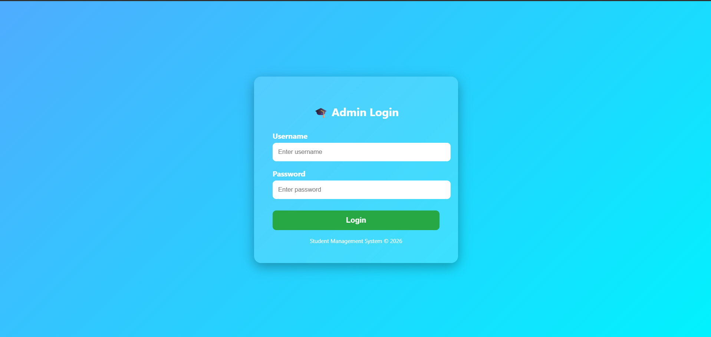
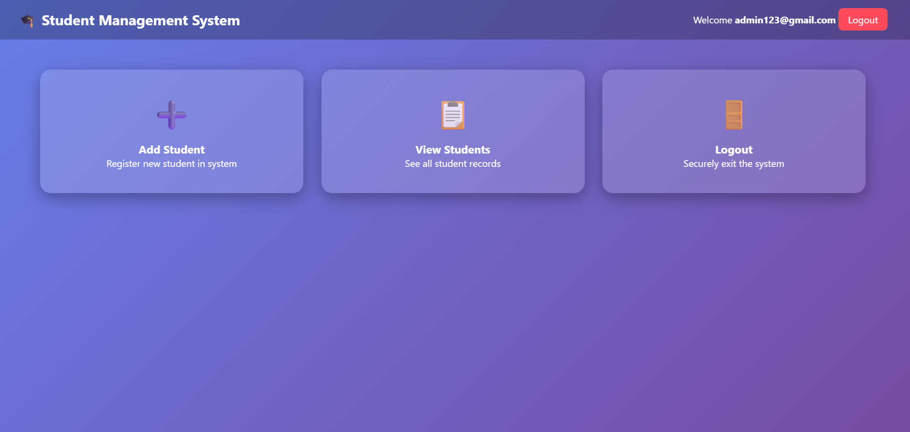
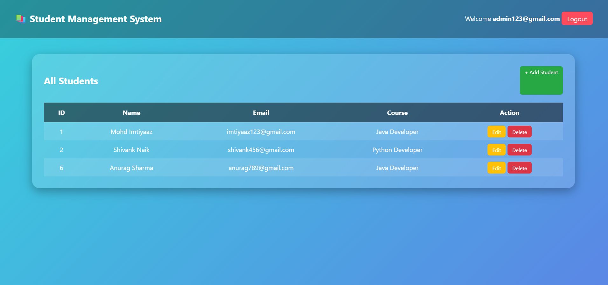
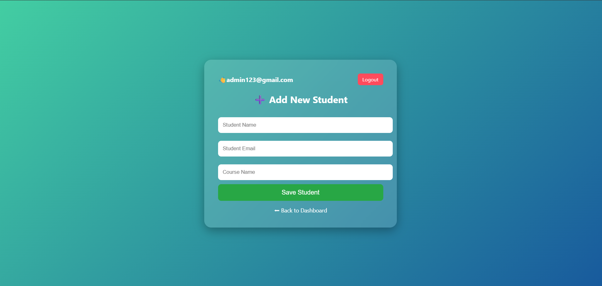

# Student Management System

## Project Overview

Student Management System is a web-based application developed using Java, JSP, Servlets, JDBC, and MySQL. The application helps administrators manage student records efficiently through a user-friendly interface.

The system follows the MVC (Model-View-Controller) architecture and provides authentication, student management, and database integration.

---

## Features

* User Login and Logout
* Session-Based Authentication
* Add New Student
* View Student List
* Update Student Information
* Delete Student Records
* MySQL Database Integration
* MVC Architecture
* Responsive User Interface

---

## Technologies Used

### Backend

* Java
* Servlets
* JDBC

### Frontend

* JSP
* HTML
* CSS

### Database

* MySQL

### Server

* Apache Tomcat

### Version Control

* Git
* GitHub

---

## Project Structure

src/main/java

* dao
* model
* servlet
* filter
* util

src/main/webapp

* login.jsp
* home.jsp
* add-student.jsp
* edit-student.jsp
* list-students.jsp
* style.css

---

## Screenshots

### Login Page

Add screenshot here:

### Home Page

Add screenshot here:

### Student List

Add screenshot here:

### Add Student

Add screenshot here:

---

## How to Run the Project

### Prerequisites

* Java JDK 8 or above
* Apache Tomcat 9+
* MySQL Server
* Eclipse IDE

### Steps

1. Clone the repository:

git clone https://github.com/imtiyaaz201298-droid/student-management-system.git

2. Import the project into Eclipse.

3. Create a MySQL database.

4. Update database credentials in DBConnection.java.

5. Add the MySQL JDBC driver.

6. Configure Apache Tomcat in Eclipse.

7. Deploy and run the project.

8. Open the browser and access:

http://localhost:8085/SMS

---

## Author

Mohd Imtiyaaz

GitHub:
https://github.com/imtiyaaz201298-droid
